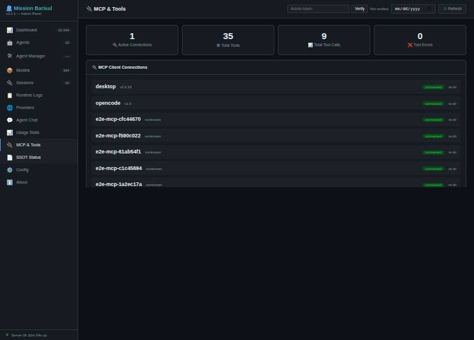
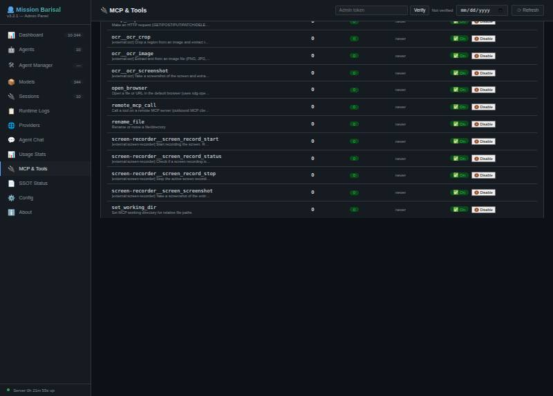
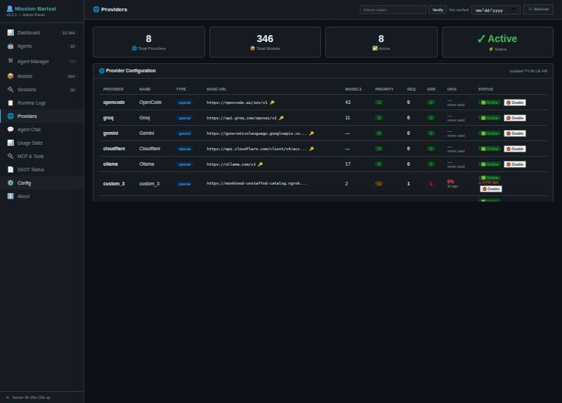
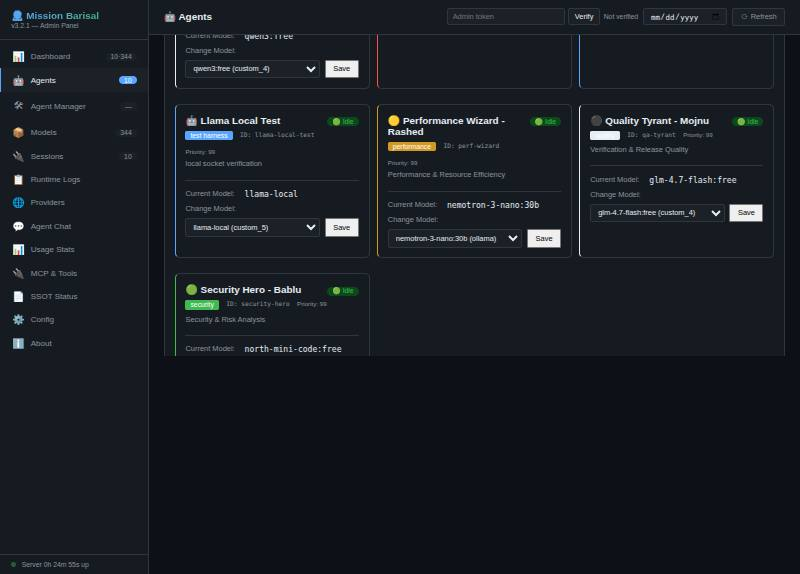

# 🧟 ZombieCoder — Mission Barisal · Monu The Builder


> **Where evidence meets conversation** — a zero-dependency Node.js server that speaks
> MCP over **HTTP JSON-RPC / SSE / WebSocket / Unix socket**, speaks **OpenAI** on
> `/v1`, runs **10 agents**, and can serve a CPU llama.cpp model from RAM behind its
> own local socket. Every claim in this file carries a log line, a JSON excerpt or a
> screenshot — and every known flaw stays listed.

The server is the **server half of the Mission Barisal platform**: agents, tool bus,
anti-dote chain, DB-backed telemetry, and a provider ladder (local → cloud) that any
OpenAI-compatible client can consume. The browser admin panel manages models,
providers, sessions, usage and per-tool switches at runtime.

**Document produced by Sahon Srabon · Developer Zone · Dhaka, Bangladesh**
[zombiecoder.my.id](http://127.0.0.1:3000/) · infi@zombiecoder.my.id
Architected by **Monu — The Builder** (Mission Barisal persona).

---

## System Architecture

```
┌────────────────────────────────────────────────────────────────────┐
│                ANY CLIENT (VS Code · SDKs · curl)                  │
└───────────┬──────────────────────┬─────────────────────────────────┘
            │ OpenAI /v1           │ MCP (JSON-RPC · SSE · WS · UDS)
            ▼                      ▼
┌────────────────────────────────────────────────────────────────────┐
│                     MISSION BARISAL SERVER                         │
│  api.js — transport resolver · agent router · anti-dote chain      │
│  ┌──────────────┐  ┌────────────────┐  ┌────────────────────────┐  │
│  │ MCP tool bus │  │ evidence gate  │  │ SQLite telemetry       │  │
│  │ 36 tools     │  │ 6-step chain   │  │ requests·sessions·     │  │
│  │ on/off switch│  │ fail-open      │  │ providers·usage        │  │
│  └──────────────┘  └────────────────┘  └────────────────────────┘  │
└───────────┬──────────────────────────────┬─────────────────────────┘
            │ provider ladder              │
            ▼                              ▼
   ┌─────────────────┐   ┌──────────────────────────────────────────┐
   │ cloud providers │   │ LOCAL LLM BRIDGE (local-llm-bridge.js)   │
   │ opencode·groq·  │   │  Unix socket ─┐                          │
   │ gemini·cloudflare│  │  loopback TCP ─┼─► llama-server (RAM)    │
   │ ollama·custom_* │   │  quirk layer   │   Llama-3.1-8B-Instruct   │
   └─────────────────┘   └────────────────┴──────────────────────────┘
```

**Zero-hallucination engineering**: first evidence, then conclusion. The anti-dote
chain runs on every execution endpoint in *monitoring mode* (records, never blocks),
and this README keeps a public Limitations section instead of hiding failures.

---

## The Mission Barisal Agents (9)

Each agent has a persona, an architecture role, and a **model mapped from the model
DB** — change it live from **Admin → Agent Manager** (`Change Model` → `Save`).

| ID | Persona | Role | Mapped model |
|----|---------|------|--------------|
| `doc-king` | Documentation King - Halim | documentation | `llama-local` |
| `team-heart` | Team Heart - Jara | general | `llama-local` |
| `customer-experience-specialist` | Customer Experience Specialist | customer-experience | `llama-local` |
| `ecommerce-operations-analyst` | E-Commerce Operations Analyst | ecommerce-operations | `llama-local` |
| `bug-hunter` | Bug Hunter - Jewel | debugging | `qwen2:0.5b` |
| `code-guru` | Code Guru - Monu | architecture | `qwen2:0.5b` |
| `perf-wizard` | Performance Wizard - Rashed | performance | `llama-local` |
| `qa-tyrant` | Quality Tyrant - Mojnu | quality | `llama-local` |
| `security-hero` | Security Hero - Bablu | security | `llama-local` |

> Mappings are live DB values shown as a snapshot (2026-09-27). Seven of the nine
> agents run on the local model `llama-local` (public alias `zombie-mini`); the
> coding pair `bug-hunter` / `code-guru` was set to `qwen2:0.5b` through
> Admin -> Agent Manager on the same day. The DB is the source of truth - edit in
> Admin -> Agent Manager; `docs/openai-schema.json` regenerates from it via
> `tools/gen-openai-docs.js`.

A virtual `mission` model runs the multi-agent debate path
(`POST /api/mission`). Calling any agent through the OpenAI API is just
`"model": "<agent-id>"` — the router resolves `agent → model → provider`.

---

## MCP Tools (36)

One registry, one enable/disable switch, four transports — `tools/list` and
`tools/call` behave identically everywhere. The full table with descriptions lives in
[`docs/openai-tools.md`](docs/openai-tools.md); the machine-readable OpenAI
function-calling conversion of all 36 tools is [`docs/openai-schema.json`](docs/openai-schema.json).

| Group | Tools |
|-------|-------|
| Agents & missions | `agent_mission` · `agent_single` · `call_agent` · `get_memory` · `append_syllabus` |
| Files & workspace | `read_file` · `write_file` · `delete_file` · `rename_file` · `list_directory` · `glob` · `grep` · `set_working_dir` · `get_working_dir` · `read_ssot` |
| Shell & system | `terminal` · `exec` · `system_info` · `env_get` |
| Web & HTTP | `web_search` · `http_request` · `browse_cdp` · `open_browser` |
| Databases | `db_query` · `db_list_tables` |
| MCP plumbing | `remote_mcp_call` |
| Screen & OCR (external) | `screen-recorder__screen_record_start/status/stop/screenshot` · `ocr__ocr_crop/image/screenshot` |
| Voice (external) | `tts__tts_play/speak/voices` |

Live registry: **36 tools, all enabled**. Call/error counters are runtime stats; the docs-vs-registry claim is re-verified on every run by `tests/docs-claims.test.js`.
Disabling a tool drops it from `tools/list` and refuses `tools/call` at one choke
point; re-enabling restores it.



> Captures are point-in-time (35 tools when captured; the live count is 36 and is
> re-verified by `tests/docs-claims.test.js`).

---

## Transports

| Transport | Endpoint | Wire format |
|-----------|----------|-------------|
| HTTP JSON-RPC 2.0 | `POST /mcp` | newline/JSON-RPC (VS Code uses `http://localhost:3000/mcp`) |
| SSE | `GET /mcp` | `endpoint` event + tool events |
| WebSocket | HTTP upgrade on `/` | full-duplex messages |
| Unix domain socket | `/tmp/zombiecoder/mcp.sock` | newline-delimited JSON-RPC (TCP fallback on Windows) |
| OpenAI HTTP | `POST /v1/chat/completions`, `GET /v1/models` | chat completions, SSE streaming |

---

## Test Commands

### Health

```bash
curl http://localhost:3000/health
# {"healthy":true,"version":"3.2.1","agents":10,"models":<live>,...}
```

### Models (real provider catalog for IDEs)

```bash
curl http://localhost:3000/api/v0/models
# {"data":[{"id":"llama-local","owned_by":"local_llm"}, ... <live> models ...]}
```

### Chat with an agent (OpenAI format — model = agent id)

```bash
curl -X POST http://localhost:3000/v1/chat/completions \
  -H "Content-Type: application/json" \
  -d '{
    "model": "bug-hunter",
    "messages": [{"role": "user", "content": "In one line: which city are you serving from?"}],
    "max_tokens": 80
  }'
```

### UDS `tools/list` (server data read straight from the socket)

```bash
printf '{"jsonrpc":"2.0","id":1,"method":"tools/list","params":{}}\n' \
  | nc -U /tmp/zombiecoder/mcp.sock
# {"jsonrpc":"2.0","id":1,"result":{"tools":[ ...36 tools with inputSchema... ]}}
```

### Local bridge (no auth header, any client)

```bash
curl http://127.0.0.1:11435/health
curl --unix-socket /tmp/local-llm.sock http://localhost/v1/chat/completions \
  -H "Content-Type: application/json" \
  -d '{"model":"llama-local","messages":[{"role":"user","content":"say PONG"}],"max_tokens":20}'
```

---

## Getting Started

### Prerequisites

- **Node.js 18+** (no npm dependencies — the server is self-contained)
- Linux (developed and verified on Linux x86_64, 4 CPU cores, 15 GB RAM)
- Optional: llama.cpp `llama-server` + a GGUF model for the local bridge

### Step 1 — Start the server

```bash
node start.js --start-all
```

Terminates any previous instance itself and brings up the gateway plus worker ports.
Admin panel: `http://localhost:3000/admin.html`.

### Step 2 — (Optional) Start the local LLM bridge

```bash
node local-llm-bridge.js
```

Auto-detects the llama-server binary and GGUF, spawns the model into RAM, and binds
both `/tmp/local-llm.sock` and `http://127.0.0.1:11435`. Ctrl-C tears down the child
process and unlinks the socket.

### Step 3 — Verify

```bash
curl http://localhost:3000/health          # server up
curl http://127.0.0.1:11435/health         # bridge up, both transports listed
```

---

## Shared OpenAI Schema — `docs/openai-schema.json`

One machine-readable manifest **generated from the live server** (not hand-written)
that every agent and any OpenAI SDK client can share:

| Key | Contents |
|-----|----------|
| `contract` | gateway / local-bridge / MCP endpoints, auth rules, request & response shapes |
| `models` | the full provider catalog (ids grouped by provider; counts sync from the DB and drift - regenerated by `tools/gen-openai-docs.js`) |
| `agents` | agent id → mapped model routing table (10 agents) |
| `tools` | all **36 MCP tools converted to OpenAI function-calling format** (`type:"function"` + JSON-Schema `parameters` taken from the MCP `inputSchema`) |
| `usage` | how to attach `tools`, how agent routing works, the local default |

**Proof it works** — the schema's own `tools` array, sent to the local model:

```json
POST http://127.0.0.1:11435/v1/chat/completions   (tools from docs/openai-schema.json)
{"model":"llama-local","choices":[{"message":{
  "content":"",
  "tool_calls":[{"type":"function","function":{
    "name":"list_directory","arguments":"{\"path\":\".\"}"}}]},
  "finish_reason":"tool_calls"}]}
```

---

## Local LLM Bridge (`local-llm-bridge.js`)

One standalone, zero-dependency script so every llama.cpp/Ollama quirk stays **out**
of the gateway: the bridge speaks clean OpenAI dialect on two transports and absorbs
local-model weirdness itself.

```
   gateway or any client          same handler
┌────────────────┐   Unix socket  ┌──────────────────┐  loopback   ┌──────────────┐
│  api.js / SDK  │ ─────────────► │ local-llm-bridge │ ──────────► │ llama-server │
│  CUSTOM_       │   or TCP :11435│  quirk layer Q1.. │ ◄────────── │ model in RAM │
│  PROVIDER_5    │ ◄───────────── │  Q10             │             │ (2.4 GB RSS) │
└────────────────┘                └──────────────────┘             └──────────────┘
```

Routes served on **both** transports: `GET /health` · `GET /v1/models` ·
`POST /v1/chat/completions` (stream and non-stream).

### Quirk layer (all inside this file)

| # | Quirk absorbed |
|---|----------------|
| Q1 | No auth required — Authorization accepted, never needed; permissive CORS |
| Q2 | Model aliasing — any caller model name answered by the configured GGUF; response echoes the caller's name |
| Q3 | Reasoning-tag stripping on non-stream **and** stream (holdback scanner survives markers split across SSE chunks) |
| Q4 | Text tool-call formats converted to real OpenAI `tool_calls` + `finish_reason:"tool_calls"` |
| Q5 | Empty reply while tools were sent → one retry without tools |
| Q6 | Backend rejects the tools block (template/grammar/PEG errors) → one retry with a JSON-tool hint carrying the full tool spec |
| Q7 | `response_format:"json_object"` → first balanced JSON value extracted from prose |
| Q8 | Missing usage → estimated and flagged `usage.estimated:true` (never passed off as exact) |
| Q9 | Stream normalization — identity stamped on every chunk, guaranteed `data: [DONE]`, `: hb` heartbeat every 15 s |
| Q10 | Header-tolerant body parsing; friendly JSON errors instead of upstream HTML |

### Configuration (environment variables)

| Variable | Default | Meaning |
|----------|---------|---------|
| `BRIDGE_BACKEND` | `auto` | `auto` / `llama` / `ollama` |
| `LLAMA_SERVER_BIN` | auto-detect | llama-server binary (verified: v0.5.0-dev, build 11146) |
| `BRIDGE_GGUF` | scan | exact GGUF path if set; otherwise **discovered at runtime** by scanning every `*.gguf` under `~/.local/share/models` and the Hugging Face hub cache (no fixed list — the folder may move) |
| `BRIDGE_GGUF_HINT` | unset | substring used to pick one file among the scanned candidates (e.g. `Meta-Llama-3.1-8B`); newest match wins |
| `BRIDGE_MODEL` | `llama-local` | wire model name |
| `BRIDGE_PORT` | `11435` | loopback TCP |
| `BRIDGE_SOCKET` | `/tmp/local-llm.sock` | Unix socket (perm 0666) |
| `BRIDGE_INTERNAL_PORT` | `18777` | llama-server loopback only |
| `BRIDGE_CTX` | `16384` | context (gateway prompts measure ≈ 6.2 k tokens) |
| `BRIDGE_THREADS` | CPU count | inference threads |
| `BRIDGE_TIMEOUT_MS` | `280000` | upstream timeout |

The bridge supervises llama-server itself (auto-respawn) and sets `cache_prompt:true`
so repeated gateway context can skip re-prefill. Gateway wiring (`.env`, git-ignored):

```
CUSTOM_PROVIDER_5_NAME=local_llm
CUSTOM_PROVIDER_5_URL=http://127.0.0.1:11435/v1
CUSTOM_PROVIDER_5_SOCKET=/tmp/local-llm.sock
CUSTOM_PROVIDER_5_MODELS=llama-local
```

`.env` is the single source of truth for provider rows: keep `..._MODELS` aligned
with the canonical id above — a stray value here silently re-maps the provider on
the next env re-sync (drift observed and corrected on 2026-09-26). And start exactly
**one** bridge at a time (Design log S1): it must be the sole owner of both the
socket and the internal port.

### Portable model discovery + external launcher

No folder is treated as final: the bridge **scans** its model roots at every
start instead of remembering a path, so copying the whole setup elsewhere needs
zero reconfiguration (env vars only, all optional). A sibling launcher folder
(`lama/`, outside this repo) wraps the bridge with env-only defaults —
`run.sh [start|status]`, a README describing the port/socket contract, and a
Colab note as the cloud fallback when the local runtime is unavailable.

Verified on this machine: `Meta-Llama-3.1-8B-Instruct-Q4_K_M` (bartowski GGUF,
4.7 GB) answers exactly through the UDS (`UDS-OK`), emits native `tool_calls`
(`get_weather {"city":"Dhaka"}`), and reaches the gateway as provider
`custom_5`. An earlier IQ3_XS build of the same family produced looping prose
even with a matching sha256 — quarantined in favor of the Q4_K_M quant.

---

## Tool sanitizer (`tools/tool-sanitizer.js`)

Last-resort layer for **custom providers and small local models** that cannot
emit native OpenAI `tool_calls` and answer in plain text instead. It is a new
layer only — the existing design is untouched: `api.js` adds one `require` and
one hook inside `callModelWithTools`, all logic lives in the module.

Runs **only** when the model returned no native calls while tools were sent,
and only extracts explicit markers — never invents calls, and (when a tool list
is present) accepts only names that were actually sent:

| # | Dialect recognized |
|---|--------------------|
| D1 | fenced ` ```tool_call ` block (single JSON or array) |
| D2 | fenced ` ```function_call ` block (same payload shape) |
| D3 | `<invoke name="…">` tags |
| D4 | canonical marker `[[FL]]{"name":…,"arguments":…}[[/FL]]` (the format a prompt can instruct) |
| D5 | first balanced bare JSON `{name, arguments}` in the text |

Extraction is logged as `SANITIZED_TOOL_CALLS` with the winning dialect;
cleaned text replaces the raw content so markers are not echoed back.
`formatHint(tools)` returns the one-line prompt instruction that tells a
model to use the canonical marker when it cannot call tools natively.

```bash
node tools/tool-sanitizer.js --selftest   # 13 assertions, all must pass
```

---

## Design log — 2026-09-26 (decisions & proposals)

Shared working record of today's architecture discussion: what was settled, what is
still a proposal, and what was explicitly rejected — so the same discussion does not
have to repeat.

### Settled

| # | Decision | Why |
|---|----------|-----|
| S1 | **Exactly one supervisor per local stack.** Only a single bridge process may own the internal inference port and the Unix socket. | Two bridge instances fought over the port: the loser's respawn loop failed with `couldn't bind` while an orphaned child kept serving traffic (observed 2026-09-26 evening, fixed by reducing to one). Start rule: verify no existing owner before launch. |
| S2 | **llama.cpp and Ollama stay separate processes.** Never merge the daemons; they are unified only at the identity layer behind the bridge. | Independent restart and lifetime; one clean OpenAI face for the gateway. |
| S3 | **One local-model identity, answer line always attributable.** The bridge is that identity (socket + port); responses should carry an `upstream` tag naming the line that answered. | "Clean" is only acceptable when the answering line can still be traced. *Status: the tag itself is a proposal — the bridge serves one backend at a time today (`BRIDGE_BACKEND=auto`).* |
| S4 | **The broker is an anti-corruption layer.** The gateway keeps speaking only the standard OpenAI dialect; all format translation lives in the broker; `api.js` gains no per-caller format branches; contract tests are the treaty. | Keeps the gateway independent of any single client. *Missing: a broker-side contract test.* |
| S5 | **The gateway (port 3000) is the response-collection point.** Models talk only to the server; the companion UI is deferred — its backend answered in ~1.2 s while the frontend failed to render (UI-side issue, tracked separately). | Response collection first; presentation second. |
| S6 | **Canonical local model id is `llama-local`.** Agents and docs reference it; the defective IQ3_XS quant was deleted; Q4_K_M is the verified file. | Renaming the id would break existing agent rows. |
| S7 | **Dual tool contract, stated explicitly.** Non-stream single-agent requests execute tools server-side (loop capped at MAX_ROUNDS, then a forced text final); streaming requests forward `tool_calls` deltas and do NOT execute — the client is the executor. | Observed live 2026-09-26 night: the non-stream path logged real `MCP_CALL` executions, while a stream round forwarded tool_call fragments with zero executions. |

### Proposals (open)

| # | Proposal | Verdict |
|---|----------|---------|
| P1 | Display alias `Zombie Mini` for the local model (branding fit). | **Implemented 2026-09-27** — public name `zombie-mini` maps to the canonical id `llama-local` via the `MODEL_ALIASES` env (resolved in `tools/model-alias.js` before provider routing, so it survives the normalizer prune); pinned catalog row carries the display name `Zombie Mini`. Canonical id untouched (S6). See Addendum below. |
| P2 | Aggregate `/v1/models` from both backends (llama + ollama) behind one port and route by model name. | Logical; needs multi-upstream bridge work — today the bridge picks one backend at a time. |
| P3 | **Lazy boot:** serve the model list first, probe both entry points, then load ONLY the selected model into RAM on first use (evict the previous one). | **Required by the RAM budget** — the current 8 B model alone holds ≈ 8.5 GB RSS on a 15 GB machine; loading everything at once would OOM. Cost: the first call pays ~20 s of model load. |
| P4 | Dual-face transport: the Unix socket is the memory-to-memory data path with no header ceremony; loopback TCP is the metadata face (health / models / identity handshake) for clients that expect a TCP handshake. | Accepted principle, partially implemented — both transports already serve `/health` and `/v1/models` with `auth_required:false`. |
| P5 | Inject identity/session metadata into response headers so remote clients do not treat this server as anonymous. | Logical in outline, but SSE clients may drop headers and headers must never leak secrets — **needs a concrete spec** (the shared fragment was incomplete). |
| P6 | Use the CDP pipe as the "king's driver" for outbound browsing/identity. | Scope-limited: `browse_cdp` is an MCP tool, not part of the inference path — keep the two separate. |
| P7 | Execute tools server-side inside the streaming path too (or require clients to execute and ship an executor). | Blocking for the UI: today a streamed tool-call round ends with an empty content bubble (S7). Needs a decision before browser work resumes. |

### Rejected / bounded

- **Load all local models into RAM at once** — rejected (OOM; see P3).
- **Merge llama-server and Ollama into one daemon** — rejected (S2).
- **Name-based format branches in `api.js`** ("if the caller is the broker, answer in
  his format") — refined to S4: standard dialect at the gateway, translation in the
  broker.
- **Deep-debugging the companion UI** — deferred (S5).

### Live verification — 2026-09-26 night (tool chain)

- **Fixed:** the streaming empty-response retry discarded valid tool-call-only
  rounds (`EMPTY_RESPONSE_RETRY` fired at 18:50:55 on a correct
  `get_weather {"city":"Dhaka"}` call and re-ran without tools). The condition now
  requires zero content **and** zero tool calls — zero occurrences after the fix
  across every stream test.
- **Measured** (local model over the Unix socket): direct chat 1.5 s; direct tool
  round 3.5 s; non-stream agent full loops 148 s / 303 s / 383 s (persona prompt
  ≈ 5.7 k tokens, first round ≈ 147 s, cached mid-loop rounds ≈ 10 s); one stream
  agent round ≈ 155 s ending in an empty bubble (P7).
- **Findings:** (a) test requests without a body `session_id` / `client_id` silently
  share the default session and pollute each other; (b) the 1 B model sometimes
  passes the tool's JSON schema as its arguments (harmless for no-parameter tools;
  correct arguments observed for parameterised ones); (c) `get_weather` is a
  sanitizer fixture, not a gateway tool — `executeMcpTool` correctly answers
  "Tool not found" for unknown names; (d) model selection now logs `HINT_NO_MATCH`
  instead of silently falling back to the newest file.

### Addendum — 2026-09-27 (P1 alias, context alignment, real execution)

- **P1 landed:** public model name `zombie-mini` resolves to the canonical id
  `llama-local` through the `MODEL_ALIASES` env (`tools/model-alias.js`, applied at
  the top of `resolveProvider` / `resolveApiModel` in `api.js`), and a pinned catalog
  row carries the display name `Zombie Mini`. The alias cannot live in the provider
  model list: `runNormalizerSync` prunes any entry the upstream does not report, and
  llama.cpp reports only its loaded model — so the alias map is applied before
  routing instead. Live proof: `PROXY_ROUTE primaryProvider:custom_5` →
  `UDS_OUTBOUND socket=/tmp/local-llm.sock` → bridge `REQ model=llama-local`
  (upstream always canonical, S6) → 1.4 s local reply, no cloud hop.
- **S8 — precision context (latency alignment):** the system prompt no longer ships
  bulk. `tools/context-slimmer.js` injects (1) the syllabus as an index of titles
  plus only input-matched entries under a 1500-char budget (live file 10 638 →
  ~2 070 chars), (2) the SSOT checked after every user input as a relevance excerpt
  (≤ 900 chars, `buildSSOTExcerpt`), and (3) tool prose as names + parameter names
  only — full schemas already travel in the request's `tools` argument
  (`compactToolsText`). Full files stay on disk for `read_file` retrieval:
  awareness, not dumps.
- **Already in place, verified (no change needed):** last-ten history in RAM
  (`MAX_HISTORY`, default 10) and every message archived per session+agent
  (`saveAgentMemory` + `archiveSession` — evidence: `data/<session>/<agent>.json`
  entries `["user","assistant"]` after each run).
- **Measured after alignment:** first agent round 147.9 s → **13.75 s**; prompt
  5 674 → **2 739 tokens** (−52 %).
- **Real daily-tools execution** (non-stream, server-side): 5 × `MCP_CALL` —
  `write_file` → `read_file` → `list_directory` → `exec (uname -s)` → retry-list;
  `data/daily-check.txt` really contains `content barisal-ok` on disk; full loop
  221 s under desktop load. The first attempt had returned HTTP 502 at the 300 s
  per-call limit because machine load cut prompt prefill to 32.8 tok/s and the
  1 B peg-format retry doubled the call — `OLLAMA_TIMEOUT_MS` raised
  300000 → 600000 in `.env` (documented inline).
- **Honest caveats:** the 1 B still shows known quirks (JSON schema passed as
  arguments on some calls, a trailing ` directory` glued onto a list path,
  peg-format rejects triggering retry/fallback — the stream smoke test fell back
  to `qwen2:0.5b` once via `STREAM_ERROR_MODEL_FALLBACK`), and local latency
  scales with machine load (the 13.75 s round measured at `load < 2`; the same
  prefill took 112 s at `load ≈ 6`).
- **Roster:** seven of nine agents on `llama-local`; `bug-hunter` and `code-guru`
  set to `qwen2:0.5b` via a live Admin -> Agent Manager save the same day (kept as
  the user's latest choice — DB stays the source of truth).

---

## Evidence

Same-day captures from this machine. Screenshots live in `docs/evidence/`; logs in
`logs/` (server) and the bridge stdout. Counts in this section (models, providers,
calls) are point-in-time values that drift with DB sync; the enforced claims live
in `tests/docs-claims.test.js`. Evidence #6 and #9 capture the demo agent
`llama-local-test`, which was removed from the roster and the seed snapshot on
2026-09-27 (decision: test artifacts stay out of the client-facing model catalog).

**1. Server health**

```json
{"healthy":true,"version":"3.2.1","agents":10,"models":342,"pusher":true}
```

**2. Bridge up, both transports, no auth**

```json
GET http://127.0.0.1:11435/health
{"status":"ok","bridge":"local-llm-bridge","backend":"llama",
 "model":"llama-local","gguf":"Meta-Llama-3.1-8B-Instruct-Q4_K_M.gguf",
 "upstream":{"base":"http://127.0.0.1:18777","ready":true},
 "transports":{"unix_socket":"/tmp/local-llm.sock","tcp":"127.0.0.1:11435"},
 "auth_required":false}
```

**3. Model loaded in RAM**

```
llama-server v0.5.0-dev (build 11146) · n_ctx 16384 · RSS 8.5 GB (8B Q4_K_M)
```

**4. Gateway reached the local model over the Unix socket**

```
[INFO] UDS_OUTBOUND {"provider":"custom_5","socket":"/tmp/local-llm.sock"}
[bridge:INFO] CHAT_OK {"transport":"uds","model":"llama-local","tools":15,"ms":204257,"usage_total":6242}
```

**5. Local model produced structured tool calls**

```json
{"finish_reason":"tool_calls",
 "tool_calls":[{"function":{"name":"get_weather","arguments":"{\"city\":\"Barisal\"}"}}]}
```

**6. Agent → local model end-to-end (truncated)**

```json
{"model":"llama-local-test",
 "choices":[{"message":{"role":"assistant","content":"…reply text…"},"finish_reason":"stop"}],
 "agent":{"id":"llama-local-test","name":"Llama Local Test","role":"test harness"}}
```

**7. Provider credentials re-verified — three independent live calls (2026-09-26)**

```json
{"model":"gemini-flash","provider":"gemini","content":"OK"}
{"model":"qwen/qwen3.8-27b","provider":"groq","content":"OK"}
{"model":"qwen2:0.5b","provider":"custom_3","content":"Okay."}
```

**8. Shared schema tools round-trip over MCP UDS**

```bash
printf '{"jsonrpc":"2.0","id":1,"method":"tools/list","params":{}}\n' | nc -U /tmp/zombiecoder/mcp.sock
# tools over UDS: 36 · every tool carries inputSchema
```

**9. Session telemetry row (DB-backed)**

```json
{"agent":"llama-local-test","model":"llama-local","provider":"custom_5",
 "status":"active","requests":6,"user_agent":"curl/8.5.0"}
```

**10. Admin MCP & Tools stats:** `9 lifetime tool calls, 0 tool errors` (capture above).





---

## Limitations (stated as-is)

1. **CPU inference is slow.** The current 8 B Q4_K_M on 4 cores measures ≈ 2.7 tok/s
   prefill / ≈ 1.6 tok/s generation (slot timings, 2026-09-26); a short agent reply
   ran ~33 s end-to-end with the 5-tool local cap, and a cold model load into RAM
   adds ~20 s. (The earlier 1 B Q8 build measured ≈ 30 / ≈ 9 tok/s.) `cache_prompt`
   is enabled but a post-change benchmark has not been run — do not read the flag
   as a proven speedup.
2. **The bridge is a separate process.** `start.js --start-all` does not start it;
   run it yourself. No systemd unit yet.
3. **Tool selection is naive.** Requests are capped at **15 tools**, chosen by slice
   order — not capability/relevance scoring.
4. **Structured `tool_calls` from cloud providers remain unproven.** With the schema's
   tools attached, `gemini-flash` fell through to `custom_3` and returned an empty
   message; the local bridge is the only path in this repo proven to emit real
   `tool_calls` (evidence #5).
5. **Mission path gaps:** `/api/mission` does not wire the `tools` parameter, and its
   final stream chunk lacks the `swap_notice` note.
6. **Telemetry mislabel (pre-existing):** 400-class upstream errors are recorded as
   `upstream_provider_rate_limit`.
7. **Provider-specific facts checked today:** `gemini-2.5-*` returns
   "no longer available to new users" on the current key (only the 3.x/3.6/3.5/3.1
   flash family works); Groq's `groq/compound*` models are not available to this key;
   `custom_3` is a **Colab Ollama + ngrok tunnel** — it dies when the Colab runtime
   sleeps and was 404 until today.
8. **Model quality:** the current 8 B Q4_K_M follows exact-reply instructions when
   the prompt is explicit (verified `SINGLE-OK`), yet a terse prompt at temperature 0
   still produced a cheeky off-target reply — plumbing is proven, judgement is not.
9. **Anti-dote is fail-open by design** (monitoring mode) — it records, never blocks.
10. **Screenshots** were captured at 0.55–0.66 page zoom to fit wide tables.

---

## Repository Hygiene

- `.env*` (provider keys and tokens), `data/`, `logs/`, `*.db` are git-ignored —
  `registry.db` is the single deliberate exception (fresh-install seed snapshot).
- No API keys in code or in this document; diffs are secret-scanned before push.
- Restart recipe: `node start.js --start-all` from the repo root — it terminates the
  old instance itself (never `pkill -f` with a pattern that matches your own shell).

---

## Project Structure

```
monu_the_builder/
├── api.js                 # the server: transports, router, anti-dote, telemetry
├── start.js               # start-all supervisor (gateway + worker ports)
├── local-llm-bridge.js    # local llama.cpp/OpenAI bridge (UDS + TCP, quirk layer)
├── mcp-client.js          # outbound MCP client
├── external-mcp.js        # external MCP server wiring
├── cdp-pipe.js            # Chrome DevTools pipe for browse_cdp
├── note-store.js          # note/memory persistence
├── PERSONAS.md            # agent persona source
├── public/                # admin.html (runtime admin panel)
├── data/                  # SQLite DBs (git-ignored) + config
├── docs/                  # openai-schema.json · evidence screenshots · guides
├── doc/                   # long-form documentation
├── agent/ · cache/ · logs/
├── tests/ · Test/          # live test suites + archived test material
├── external tools/ · external mcp/  # php-broker, OCR/screen/TTS servers
├── tools/                  # gen-openai-docs.js (docs from the live registry), tool-sanitizer.js (marker → tool_calls)
├── registry.seed.json     # model/provider seed (text)
├── registry.db            # same seed as binary snapshot (fresh-install path)
├── start-local-mcp.js      # standalone MCP starter
└── domain-config.js        # env-driven domain/identity config
```

---

## Support

- **Website**: [zombiecoder.my.id](http://127.0.0.1:3000/)
- **Email**: infi@zombiecoder.my.id
- **Issues**: [GitHub Issues](https://github.com/sahonsrabon-os/monu_the_builder/issues)

---

_Built by Sahon Srabon · Developer Zone · Dhaka, Bangladesh. ZombieCoder — Mission
Barisal is not affiliated with GitHub or Microsoft. GitHub Copilot is a trademark of
GitHub, Inc. Document maintained by Monu (The Builder) — evidence first, then
conclusion._
